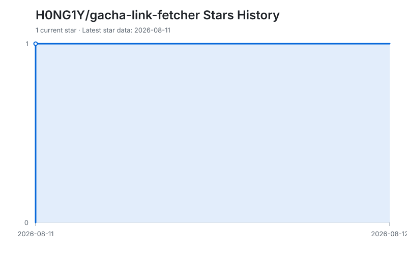



# Gacha Link Fetcher

**Local link discovery, history sync, backups, exports, and analysis**

## About

A local Windows application that discovers gacha-history links from game logs or caches. After your explicit confirmation, it queries the corresponding game's official history API. Synced data stays on your PC and can be backed up, restored, exported, and analysed.

## Supported games

| Game | History page |
| --- | --- |
| Wuthering Waves | Convene History |
| Genshin Impact | Wish History |
| Honkai: Star Rail | Warp Records |
| Zenless Zone Zero | Signal Search Records |

## Download

Download the latest version from [GitHub Releases](https://github.com/H0NG1Y/gacha-link-fetcher/releases/latest).

## Usage

1. Open any banner and its history page in the target game.
2. Run the EXE and select the correct game.
3. Select **Automatically get link**. If needed, select the game directory manually.
4. To save and analyse records, select **Sync records**, read the prompt, and confirm the official API request.
5. Choose **All banners** or a specific banner, then view, analyse, or export the filtered records.

## Features

- Checks common installation directories, including official launcher, WeGame, Steam, and Epic paths for Wuthering Waves
- Reads the latest history link from local logs or `webCaches`
- Downloads every available page for every known banner only after user confirmation, then merges by game, account, shared-pity banner group, and record ID
- Displays correct banner names; banners sharing pity are merged into one selectable group for the table, analytics, and exports
- Automatic local backups (latest 20 retained), plus manual backup and restore
- CSV, Excel-compatible SpreadsheetML XML, and generic JSON export
- UIGF v4 export for Genshin Impact, Honkai: Star Rail, and Zenless Zone Zero
- Per shared-pity banner group totals, rarity counts, current pity, and average top-rarity interval
- Privacy-safe diagnostic summary with no link, account, or file path

## Data and privacy

- Link discovery only reads local logs or caches. Links remain in memory or the clipboard and are never written to the local data file.
- The app contacts an official history API only after you choose **Sync records** and approve the confirmation prompt. It uses the temporary credential in the current link for that request.
- Local logs, caches, and backups are never uploaded. Synced records are stored only in `%LocalAppData%\GachaLinkFetcher\records.json`.
- Backups are stored in `%LocalAppData%\GachaLinkFetcher\backups` and can be deleted by the user.
- The application does not modify game files, the registry, or system permissions.

> A gacha-history link contains a temporary query credential. Never post it publicly, send it to strangers, or include it in an issue.

## FAQ

**No link was found?**

Open the in-game history page and wait for it to load, then try again. If it still fails, manually choose the actual game directory.

**Sync failed or the link expired?**

History credentials expire. Reopen the in-game history page, retrieve a new link, and retry. A game-side API change can also require an application update.

**Why is the Excel export an XML file?**

It is a native SpreadsheetML workbook that Excel opens directly, without bundling additional dependencies.

## Source layout

- `Models/`: game definitions, gacha records, and local data models
- `Services/`: link discovery, official API requests, exports, and analytics
- `Storage/`: local JSON data and backups
- `UI/`: WinForms main interface

## Disclaimer

This is an unofficial player-made tool and is not affiliated with Kuro Games, miHoYo, or HoYoverse. Game updates that change logs, locations, or history APIs may require an update.

[中文说明](README.md)

## Star History

